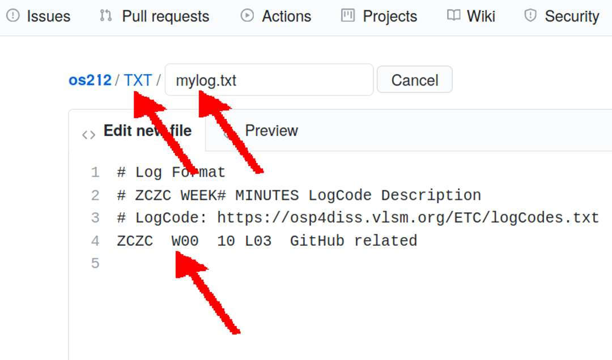
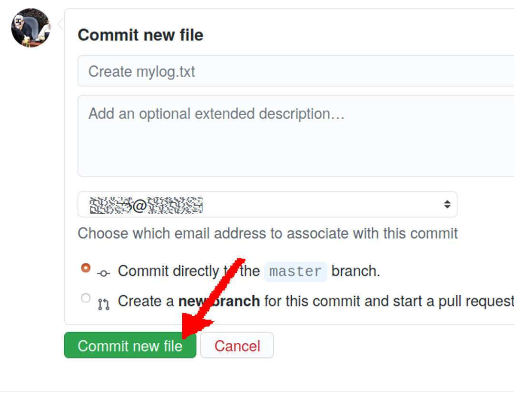

[&#x213C;](#endofpage) 
# SP Week 00 Assignment #2: "TXT/mylog.txt"

## Start Week 00 Log

* See <https://doit.vlsm.org/ETC/logCodes.txt>

[&#x213C;](#) 
## Add file --> Create a new file

* The 
  following is an example from the previous year (os212)

[&#x213C;](#) 
## Folder/File: "TXT/mylog.txt"

* The 
  following is an example from the previous year (os212)

[&#x213C;](#) 
## Commit a new file

[&#x213C;](#)  
