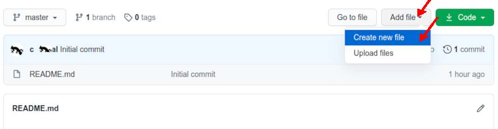
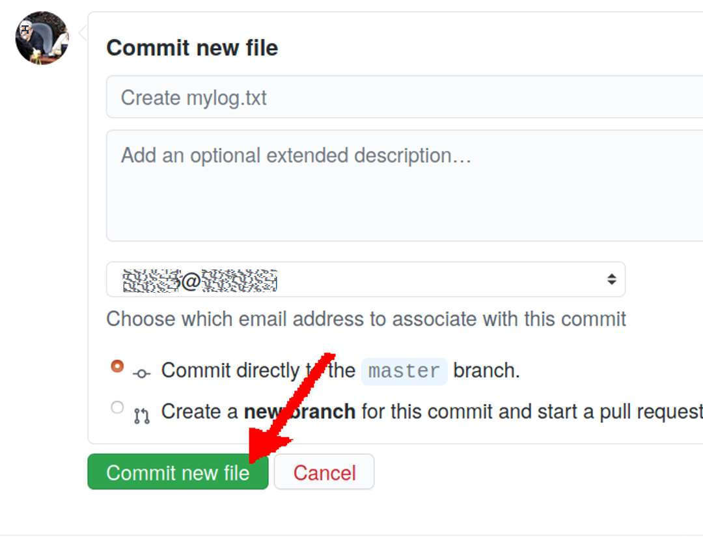

# OS Week 00 Assignment #2: "TXT/mylog.txt"

## Start Week 00 Log

* Follow Up at [OS Week 00 Assignment #6](W00-06.html){:target="_blank"}
* See also <https://doit.vlsm.org/ETC/logCodes.txt>{:target="_blank"}

[&#x213C;](#endofpage) 
## Add file --> Create a new file

* The 
  following is an example from the year 2021 (os212)

[&#x213C;](#) 
## Folder/File: "TXT/mylog.txt"

* The 
  following is an example from year 2021 (os212)

[&#x213C;](#) 
## Commit a new file

[&#x213C;](#) 

* Always REMEMBER,
  you are not "cbkadal"!
  And the class is not "os212"!

[&#x213C;](#)  
