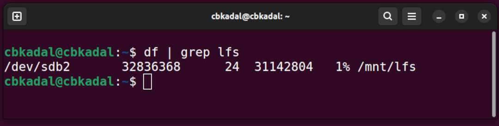

[&#x213C;](#idxXXX)<br id="idx000">
# OS Week 08 Assignment #3: Linux From Scratch 12.2 Ch. 1-5

## Preparation <span style="color:red; font-weight:bold; font-size:larger;">(IMPORTANT!)</span>

### Check file system /mnt/lfs

```
df | grep lfs

```

[&#x213C;](#)<br id="idx001">

<br>

<span style="color:red; font-weight:bold; font-size:larger;">
If there is no "/mnt/lfs", see [here](W03-02.md){:target="_blank"}.
</span>

[&#x213C;](#)<br id="idx002">
### Check some environments for your account (e.g. cbkadal) and root:

```
echo "LFS=\"$LFS $(df $LFS|tail -1|awk '{print $1,int($2/1000000)"G"}')\" ARCH=$(arch) NPROC=$(nproc)"

```

[&#x213C;](#)<br id="idx003">
## Follow "The Linux From Scratch version 12.2 Book" chapter 1-5
* VirtualBox (AMD64)
  * [LFS 12.2 ORI](https://www.linuxfromscratch.org/lfs/view/12.2/){:target="_blank"}
  ([alt1](https://lfs.mirrors.hoobly.com/lfs/view/12.2/){:target="_blank"})
  ([alt2](https://lfs-hk.koddos.net/lfs/view/12.2/){:target="_blank"})
  ([alt3](https://lfs.mirror.fileplanet.com/lfs/view/12.2/){:target="_blank"})
* UTM/M1 (ARM64/AARCH64)
  * [LFS 12.2 CBK](https://lfs.vlsm.org/arm64/){:target="_blank"} ---
    This version was adjusted to be close to the AMD ORI 12.2 version.
* Source Code Mirrors:
  ([source mirror1](https://lfs.gnlug.org/pub/lfs/lfs-packages/12.2/){:target="_blank"})
  ([source mirror2](https://mirror.fileplanet.com/lfs/pub/lfs/lfs-packages/12.2/){:target="_blank"})
  ([source mirror3](https://mirror.koddos.net/lfs/lfs-packages/12.2/){:target="_blank"})
* [Kernotex's YouTube LFS 12.2 PlayList](https://www.youtube.com/playlist?list=PLyc5xVO2uDsDzdT8lkx430hZ-gY69wgS3){:target="_blank"}
  * [Kernotex's Host Linux configuration for LFS Chapter 2.2 - "Host System Requirements"](https://www.youtube.com/playlist?list=PLyc5xVO2uDsCQChvKRDhF-cvsguDfd-y2){:target="_blank"}
  * [Kernotex's LFS in VirtualBox](https://www.youtube.com/playlist?list=PLyc5xVO2uDsB4gJ2dPySvs2eK_roFwKeb){:target="_blank"}

[&#x213C;](#)<br id="idx004">
## <span style="color:red; font-weight:bold; font-size:larger;">Take Note: SKIP Ch 2.4, 2.5, 2.7</span>
Because "/mnt/lfs/" already exists!
* <span style="color:red; font-weight:bold; font-size:larger;">SKIP</span>
  [Chapter 2.4. Creating a New Partition](https://www.linuxfromscratch.org/lfs/view/12.2/chapter02/creatingpartition.html){:target="_blank"} 
* <span style="color:red; font-weight:bold; font-size:larger;">SKIP</span>
  [Chapter 2.5. Creating a File System on the Partition](https://www.linuxfromscratch.org/lfs/view/12.2/chapter02/creatingfilesystem.html){:target="_blank"}
* <span style="color:red; font-weight:bold; font-size:larger;">SKIP</span>
  [Chapter 2.7. Mounting the New Partition](https://www.linuxfromscratch.org/lfs/view/12.2/chapter02/mounting.html){:target="_blank"}

[&#x213C;](#)<br id="idx005">
## <span style="color:red; font-weight:bold; font-size:larger;">Take Note: DO NOT SKIP Ch 2.6, 3.1 (ROOT)</span>
* [Chapter 2.6. Setting The $LFS Variable](https://www.linuxfromscratch.org/lfs/view/12.2/chapter02/aboutlfs.html){:target="_blank"} ([ARM64](https://lfs.vlsm.org/arm64/chapter02/aboutlfs.html){:target="_blank"}).
* [Chapter 3.1. Introduction](https://www.linuxfromscratch.org/lfs/view/12.2/chapter03/introduction.html){:target="_blank"} ([ARM64](https://lfs.vlsm.org/arm64/chapter03/introduction.html){:target="_blank"}).

Use this SCRIPT for chapter 3.1. Make sure no ERRORS!
* See also os1:///home/zzyLFS/

```
# ROOT
# This is for both VirtualBox and UTM
#
if [[ "$(id -u)" == "0" ]] ; then
echo "============================================"
echo "LFS should be /mnt/lfs AND MAKEFLAGS = cores"
echo "LFS=$LFS MAKEFLAGS=$MAKEFLAGS"
echo "============================================"
sleep 3
mkdir -pv $LFS/sources/
chmod -v  a+wt $LFS/sources/
cd        $LFS/sources/
wget -c   https://www.linuxfromscratch.org/lfs/view/12.2/wget-list-sysv --directory-prefix=$LFS/sources
wget -c   --input-file=$LFS/sources/wget-list-sysv --directory-prefix=$LFS/sources
wget -c   https://www.linuxfromscratch.org/lfs/view/12.2/md5sums --directory-prefix=$LFS/sources
md5sum -c md5sums
chown root:root $LFS/sources/*
else
echo "=== === === === ERROR: ROOT ONLY === === === ERROR ==="
echo "=== === === === ERROR: ROOT ONLY === === === ERROR ==="
echo "=== === === === ERROR: ROOT ONLY === === === ERROR ==="
fi

```

[&#x213C;](#)<br id="idx006">
Make sure files "wget-list-sysv" and "md5sums" are in $LFS/sources/

```
ls -al $LFS/sources/{md5sums,wget-list-sysv}
# -rw-r--r-- 1 root root 5110 Sep  1 02:27 /mnt/lfs/sources/md5sums
# -rw-r--r-- 1 root root 5957 Sep  1 02:27 /mnt/lfs/sources/wget-list-sysv

```
   
* <span style="color:red; font-weight:bold;">Download locations may not always be accessible</span>.
  If unsuccessful, try:<br>
  ([source mirror1](https://lfs.gnlug.org/pub/lfs/lfs-packages/12.2/){:target="_blank"})
  ([source mirror2](https://mirror.fileplanet.com/lfs/pub/lfs/lfs-packages/12.2/){:target="_blank"})
  ([source mirror3](https://mirror.koddos.net/lfs/lfs-packages/12.2/){:target="_blank"})
  * See also os1:///home/zzyLFS/
* After downloading the packages (chapter 3.1), continue to Chapter 4, and so on.
* Make sure you have <span style="color:red; font-weight:bold;">three</span> accounts:
  * your own account (e.g. <span style="color:cyan; font-weight:bold;">cbkadal</span> but you are not cbkadal!)
  * <span style="color:red; font-weight:bold;">root</span> account
  * <span style="color:green; font-weight:bold;">lfs</span> account
* <span style="color:red; font-weight:bold; font-size:larger;">Make sure when to use:</span>
  * your own account (e.g. "cbkadal")
  * root account
  * lfs account

[&#x213C;](#)<br id="idx007">
## Binutils-2.41 - Pass 1: Standard Build Unit (SBU)
[Chapter 5.2.1. Installation of Cross Binutils](https://www.linuxfromscratch.org/lfs/view/12.2/chapter05/binutils-pass1.html){:target="_blank"} (<span style="color:green; font-weight:bold;">lfs</span>)
* Check your "LFS", "ARCH", "NPROC", and "MAKEFLAGS" environment for all accounts (e.g. "cbkadal", "root", "lfs").

```
mkdir -v build
cd       build
time { ../configure --prefix=$LFS/tools \
             --with-sysroot=$LFS \
             --target=$LFS_TGT   \
             --disable-nls       \
             --enable-gprofng=no \
             --disable-werror    && make && make install; }
echo "ZCZC I am $(whoami)@$(hostname) using $(uname -r) $(df $LFS|tail -1|awk '{print $1,int($2/1000000)"G"}')" 
echo "LFS=\"$LFS\" ARCH=$(arch) NPROC=$(nproc) MAKEFLAGS=$MAKEFLAGS"

```

[&#x213C;](#)<br id="idx008">
## Generate LFS Chapters 1-5 Report

Last, after finishing chapter 5, run (<span style="color:cyan; font-weight:bold;">cbkadal</span>):

```
export LFS="/mnt/lfs/"
cd $HOME/mywork/WEEK08/
bash 08_WEEK08.sh

```

[&#x213C;](#)<br id="idx009">
## Result/Report

(<span style="color:cyan; font-weight:bold;">cbkadal</span>):

```
cd $HOME/RESULT/W08/
ls -al

```

[&#x213C;](#)<br id="idxXXX">

