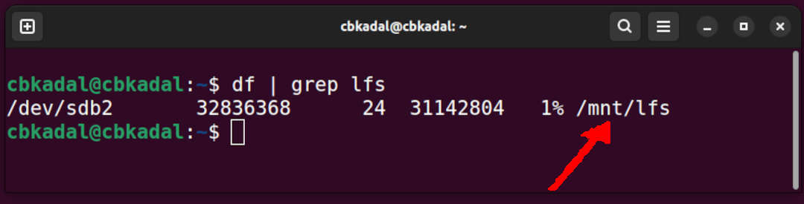
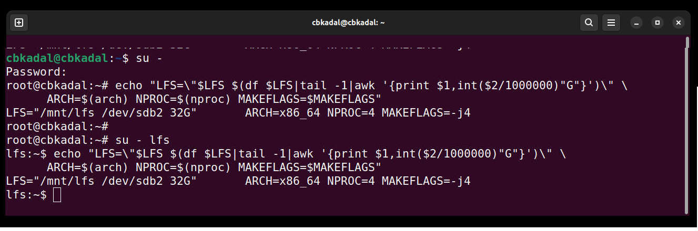

[&#x213C;](#idxXXX)<br id="idx000">
# OS Week 09 Assignment #3: Linux From Scratch 12.1 Ch. 6-7
## Preparation <span style="color:red; font-weight:bold; font-size:larger;">(IMPORTANT!)</span>
### Check file system /mnt/lfs

```
df | grep lfs

```

[&#x213C;](#)<br id="idx001">

<br>
<span style="color:red; font-weight:bold; font-size:larger;">
If there is no "/mnt/lfs", see [here](W03-02.md).
</span>

[&#x213C;](#)<br id="idx002"><br>

## Three (3) Accounts
* your own account, e.g., <span style="color:red; font-weight:bold; font-size:larger;">(user cbkadal)</span>
* root account <span style="color:red; font-weight:bold; font-size:larger;">(root)</span>
* lfs account <span style="color:red; font-weight:bold; font-size:larger;">(user lfs)</span>

### Check ALL environments for ALL accounts (cbkadal, root, lfs):

```
echo "LFS=\"$LFS $(df $LFS|tail -1|awk '{print $1,int($2/1000000)"G"}')\" \
     ARCH=$(arch) NPROC=$(nproc) MAKEFLAGS=$MAKEFLAGS"

```


<br>

<br>
[&#x213C;](#)<br id="idx003">
## Follow "The Linux From Scratch version 12.1 Book" chapter 6-7
* VirtualBox (AMD64)
  * [The Linux From Scratch version 12.1 Book](https://www.linuxfromscratch.org/lfs/view/12.1/)
  ([mirror1](https://lfs.mirrors.hoobly.com/lfs/view/12.1/))
  ([mirror2](https://lfs-hk.koddos.net/lfs/view/12.1/))
  ([mirror3](https://lfs.opensource.foundation/lfs/view/12.1/))
* UTM/M1 (ARM64/AARCH64)
  * [The Linux From Scratch ARM64/AARCH64 Book](https://www.linuxfromscratch.org/~xry111/lfs/view/arm64/)
  * <span style="color:red; font-weight:bold; font-size:larger;">COMPARE</span><br>
    <b>LFS ARM64/AARCH64</b> is not an official version (KW) and changes frequently.
    Therefore, it is recommended to use a package similar to the official version of LFS 12.1 (ORI).
    Because of this, the instructions for the KW version packages often
    <span style="color:red; font-weight:bold; font-size:larger;">differ</span>
    from those for the ORI.  Since it uses the ORI package, it must sometimes be compiled using the ORI method.
    Please be careful, especially when working on chapter 8 and explicitly compiling GCC (chapter 8.27).
    * <span style="color:red; font-weight:bold; font-size:larger;">VISIT</span>
      <https://yforku.github.io/os242/LFS/>.
* Source Code Mirrors:
  ([source mirror1](https://lfs.gnlug.org/pub/lfs/lfs-packages/12.1/))
  ([source mirror2](https://mirror.fileplanet.com/lfs/pub/lfs/lfs-packages/12.1/))
  ([source mirror3](https://mirror.koddos.net/lfs/lfs-packages/12.1/))
* [Kernotex's YouTube LFS 12.1 PlayList](https://www.youtube.com/playlist?list=PLyc5xVO2uDsCKdz6-Ojah0o-ZTqGE7HEX)
  * [Kernotex's Host Linux configuration for LFS Chapter 2.2 - "Host System Requirements"](https://www.youtube.com/playlist?list=PLyc5xVO2uDsCQChvKRDhF-cvsguDfd-y2)
  * [Kernotex's LFS in VirtualBox](https://www.youtube.com/playlist?list=PLyc5xVO2uDsB4gJ2dPySvs2eK_roFwKeb)

[&#x213C;](#)<br id="idx004">
## <span style="color:red; font-weight:bold; font-size:larger;">Take Note!</span>

### You might want to combine the commands in chapter 7.2-7.4 <span style="color:red; font-weight:bold; font-size:larger;">(root)</span>

```
echo "= (1) ======================================"; sleep 1
echo "LFS=$LFS NPROC=$(nproc) MAKEFLAGS=$MAKEFLAGS"
echo "= (2) ======================================"; sleep 1
chown -R root:root $LFS/{usr,lib,var,etc,bin,sbin}
[ -d $LFS/tools/ ] && chown -R root:root $LFS/tools/
case $(uname -m) in
  x86_64) chown -R root:root $LFS/lib64 ;;
esac
mkdir -pv $LFS/{dev,proc,sys,run}
echo "= (3) ======================================"; sleep 1
systemctl daemon-reload
mount -v --bind /dev $LFS/dev
mount -v --bind /dev/pts $LFS/dev/pts
mount -vt  proc proc  $LFS/proc
mount -vt sysfs sysfs $LFS/sys
mount -vt tmpfs tmpfs $LFS/run
echo "= (4) ======================================"; sleep 1
if [ -h $LFS/dev/shm ]; then
  mkdir -pv $LFS/$(readlink $LFS/dev/shm)
else
  mount -t tmpfs -o nosuid,nodev tmpfs $LFS/dev/shm
fi
echo "= (5) ======================================"; sleep 1
df /
echo "= (6) ======================================"; sleep 1
chroot "$LFS" /usr/bin/env -i   \
    HOME=/root                  \
    TERM="$TERM"                \
    PS1='(lfs chroot) \u:\w\$ ' \
    PATH=/usr/bin:/usr/sbin     \
    MAKEFLAGS=-j$(nproc)        \
    /bin/bash --login

```

[&#x213C;](#)<br id="idx005">
### The FIRST TIME chroot RESULT

```
(lfs chroot) I have no name!:/#

```

[&#x213C;](#)<br id="idx006">
## Generate LFS Ch. 6-7 Report

* After finishing chapter 7, move <span style="color:red; font-weight:bold; font-size:larger;">(root)</span>:

```
mv -v $HOME/lfs-temp-tools-*.tar.xz /var/tmp/lfs-temp-tools-12.1.tar.xz

```

[&#x213C;](#)<br id="idx007">
## Cross Check

* Cross-check that "lfs-temp-tools-12.1.tar.xz" is in /var/tmp/ <span style="color:red; font-weight:bold; font-size:larger;">(root)</span>
  * The file size should be larger than 850 MB.
  * <span style="color:red; font-weight:bold; font-size:larger;">Don't delete</span>
    the lfs-temp-tools-12.1.tar.xz file until the end of the term.
  * If prompted, you should be able to show that file.

```
date;echo $(arch; lscpu|grep -E 'Model name'|tail -1); du -s -h /var/tmp/lfs-temp-*

```

[&#x213C;](#)<br id="idx008">
## Last, run <span style="color:red; font-weight:bold; font-size:larger;">(user)</span>:

```
export LFS="/mnt/lfs/"
cd $HOME/mywork/WEEK09/
bash 09_WEEK09.sh

```

[&#x213C;](#)<br id="idx008">
## Result/Report

```
cd $HOME/RESULT/W09/
ls -al

```

[&#x213C;](#)<br id="idxXXX">

